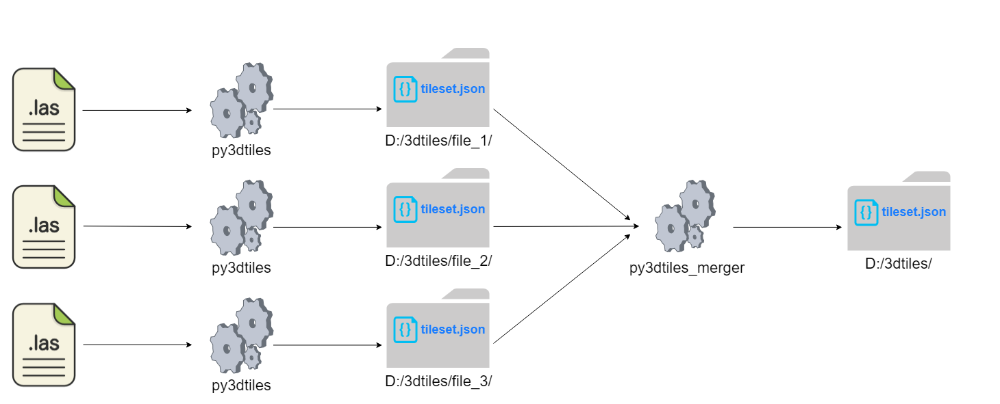

py3dtiles_merger
================

    **Disclaimer:**

    This project is under active development and has been created to generate data as fast as possible at Jakarto (rush time). It doesn't cover neither unit test, well-writen documentation, nor a sufficient level of abstraction to be used in differents contexts. However, I will be more than happy to remove this disclaimer when improvements will be done. Feel free to open an issue to help the project.

A tool to merge independant 3dtiles to ease vizualization of big 3d data on `Cesium <https://cesiumjs.org/Cesium/Build/Apps/Sandcastle/index.html>`_ or `Itowns <https://github.com/iTowns/itowns>`_.

The 3dtiles must have been generated in the same format than `py3dtiles <https://github.com/Oslandia/py3dtiles>`_ output (branch `lasTo3dtiles` until it's merged).

py3dtiles_merger generate a `tileset.json` file which points to some `tileset.json` children respecting the `3dtiles external tilesets referencing specification 
<https://github.com/AnalyticalGraphicsInc/3d-tiles#external-tilesets>`_.

Installation
#############

- Local installation *(recommanded until the project support pypi integration)*

.. code-block:: shell

    git clone https://github.com/Tofull/py3dtiles_merger
    cd py3dtiles_merger
    pip install .

Usage
###########

To merge `<child_paths>/tileset.json` into one global `tileset.json`, use:

    .. code-block:: shell
    
        # On windows
        py3dtiles_merger.exe -v -r D:/data_py3dtiles/output_merged

What's next ?
############

Once you have generate the global tileset.json, you can expose it over the Internet with any http server, like :

.. code-block:: shell

    # using https://www.npmjs.com/package/http-server
    npm install http-server -g
    http-server D:/data_py3dtiles/output_merged --cors -p 8080

Then, your tileset is available over the Internet, and you can visualize it using 3d viewer, for example Cesium sandcastle : 

1. Go to https://cesiumjs.org/Cesium/Build/Apps/Sandcastle/index.html
2. Insert the following code on Javascript Code section : 

    .. code-block:: javascript
    
        var viewer = new Cesium.Viewer('cesiumContainer');
        var tileset = viewer.scene.primitives.add(new Cesium.Cesium3DTileset({
            url : 'http://127.0.0.1:8080/tileset.json'
        }));

3. Click Run (or F8) and enjoy.

    .. image:: doc/assets/example_3dtiles_on_cesium.png
        :width: 200px
        :align: center
        :height: 100px
        :alt: Example on cesium

Contribution
#############

Contributions are welcome. Feel free to open an issue for a question, a remark, a typo, a bugfix or a wanted feature.

Licence
##########

Copyright © 2018 Loïc Messal (@Tofull) and contributors

Distributed under the MIT Licence.